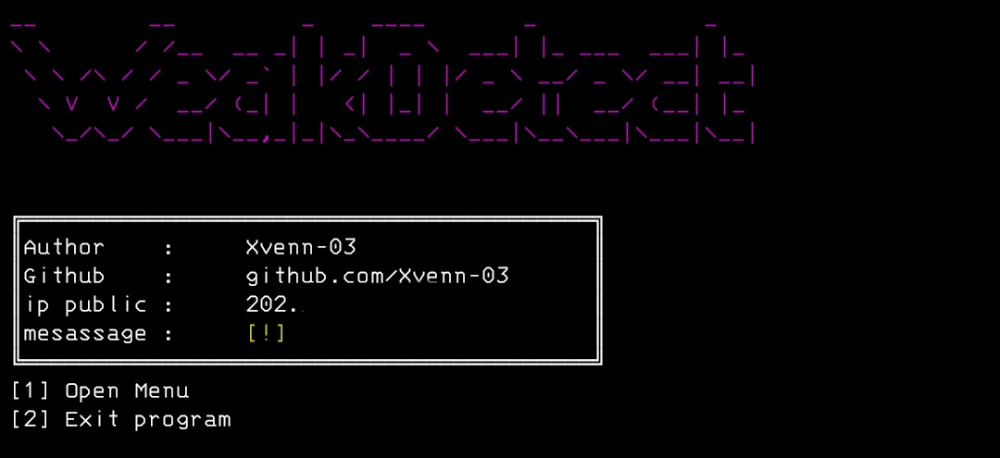

# WeakDetect

WeakDetect is a python script that aims to allow beginners in pentester/cyber security/script kiddies to install and get the basics of using it, I hope that many young people will be interested in digital security.

## The features in the script include: 
- installation on android device( termux ).
- installation on linux device.
- basics of tool usage.

## Instalations
Havefunn.
```
$ pkg update -y && pkg upgrade -y
$ apt update -y && apt upgrade -y
$ termux-setup-storage
$ pkg install git
$ pkg install python -y
$ git clone https://github.com/Xvenn-03/CPUORORv2.1.git
$ cd CPUORORv2.1
$ pip install -r requirements.txt
$ python CPUORORv2.py
```
## Important.
because I made this tool on android (termux) there might be some errors, if there is a problem just chat my gmail on github profile.

### Visitors :

